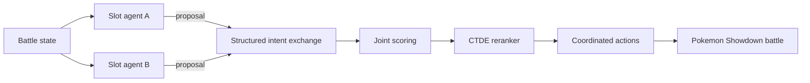

# DuoMon

> Cooperative multi-agent decision-making for Pokémon Showdown multi battles.

[](https://www.python.org/)
[](https://github.com/jorgeflmendes/duomon/actions/workflows/python-checks.yml)

DuoMon coordinates two allied slot agents that act independently at execution
time. The agents exchange structured intent messages, evaluate joint actions,
and use a CTDE-trained reranker to choose coordinated turns. A local benchmark
pipeline captures outcomes, decision traces, and replays for inspection in a
browser dashboard.

## Overview

Multi-battle decisions are coupled: individually strong moves can conflict,
duplicate targets, or expose an ally. DuoMon makes that coordination explicit.
Each agent scores legal actions, communicates a compact proposal, and
participates in joint selection while preserving decentralized execution.

The repository is designed for reproducible game-AI experiments with
configurable opponents, fixed or sampled teams, offline CTDE training, replay
capture, and per-turn decision analysis.

## Academic Context

This project was developed as part of the **Autonomous Agents and Multi-Agent
Systems** course unit at **Instituto Superior Técnico, University of Lisbon**.

This project explores autonomous decision-making, multi-agent coordination,
adversarial strategy, and intelligent agent design.

## Key Features

- Independent allied slot agents with structured intent exchange
- CTDE-trained joint-action reranking
- Legal-action generation, tactical scoring, and threat estimation
- Configurable benchmark opponents and parallel battle execution
- Fixed-team and random-team generalization evaluation
- JSONL decision traces, replay capture, and aggregate metrics
- Browser dashboard for match and per-turn reasoning inspection

## Architecture



Centralized training uses collected joint-action traces and terminal outcomes.
At runtime, the two slot agents retain separate observations and action
selection while exchanging structured coordination messages.

See [docs/ARCHITECTURE.md](docs/ARCHITECTURE.md) for the runtime decision
flow, offline training loop, and dashboard artifact boundary.

## Tech Stack

- Python 3.11+
- PyTorch
- Node.js 20+ and Pokémon Showdown
- HTML, CSS, and JavaScript dashboard
- JSONL-based experiment artifacts

## Repository Structure

```text
.
|-- duomon/
|   |-- agents/            # Communication and joint action selection
|   |-- battle/            # Showdown state adapters
|   |-- benchmarking/      # Runners, metrics, and reports
|   |-- ctde/              # Features, models, training, and evaluation
|   |-- heuristic/         # Tactical and damage scoring
|   `-- policy_core/       # Legal actions and independent policies
|-- experiments/           # Transformer experiment sandbox
|-- scripts/               # Setup, dataset, and training entrypoints
|-- teams/                 # Curated benchmark teams
`-- web/                   # Dashboard and local server
```

## Getting Started

Prerequisites: Python 3.11+, Node.js 20+, npm, and Git.

```bash
git clone --recurse-submodules https://github.com/jorgeflmendes/duomon.git
cd duomon
python -m pip install -r requirements.txt
python scripts/setup/external_dependencies.py --build
```

If the repository was cloned without submodules:

```bash
git submodule update --init --recursive
```

Start the dashboard:

```bash
python web/demo_server.py
```

Then open `http://127.0.0.1:8765/`.

Run a small benchmark:

```bash
python -m duomon --profile ctde_mlp --opponents simpleheuristics,abyssal --battles 5
```

Train the reranker from collected traces:

```bash
python scripts/training/train_ctde.py --opponent both
```

Runtime paths and behavior can be configured with the documented `DUOMON_*`
environment variables in [.env.example](.env.example).

## Running Tests

The repository does not yet contain a full automated behavioral test suite.
GitHub Actions performs portable Python syntax compilation on the core package,
scripts, and dashboard server. For a functional smoke run, initialize the
submodules and execute:

```bash
python -m duomon --profile ctde_mlp --opponents simpleheuristics --battles 1
```

## Results

Latest validated local runs using structured communication and the `ctde_mlp`
profile:

| Mode | Battles | Finished | Errors | Overall WR | Random | MaxPower | Simple | Abyssal |
| --- | ---: | ---: | ---: | ---: | ---: | ---: | ---: | ---: |
| Fixed ally teams | 800 | 800 | 0 | 87.0% | 99.5% | 94.5% | 78.0% | 76.0% |
| Random ally teams | 800 | 793 | 7 | 75.9% | 97.0% | 89.0% | 58.5% | 58.5% |

These are local experimental results, not claims about competitive ladder
performance.

## Limitations

- Full experiments require local Pokémon Showdown server and client submodules.
- Current CI checks portability and syntax but does not run battle simulations.
- Results depend on the configured opponents, teams, seeds, and trained artifacts.
- The repository does not currently provide a standalone license.

## Roadmap

- Add deterministic unit and integration tests
- Publish dashboard and replay visuals
- Add benchmark ablations for communication and CTDE reranking
- Provide a containerized reproducibility workflow
- Document model artifacts and experiment seeds in a model card

## Usage Note

DuoMon is an independent academic project. It is not affiliated with,
endorsed by, or sponsored by Pokémon, Nintendo, Game Freak, Creatures Inc., or
the Pokémon Showdown project. Pokémon and related names are trademarks of their
respective owners. Review the licenses of the upstream submodules before reuse.
