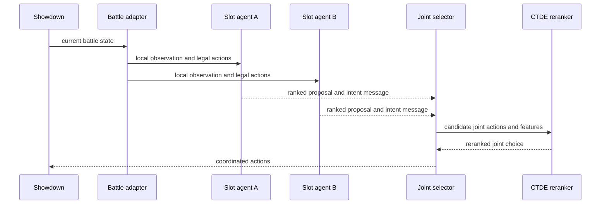
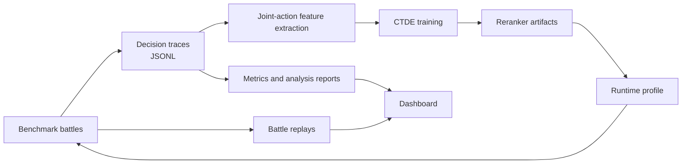
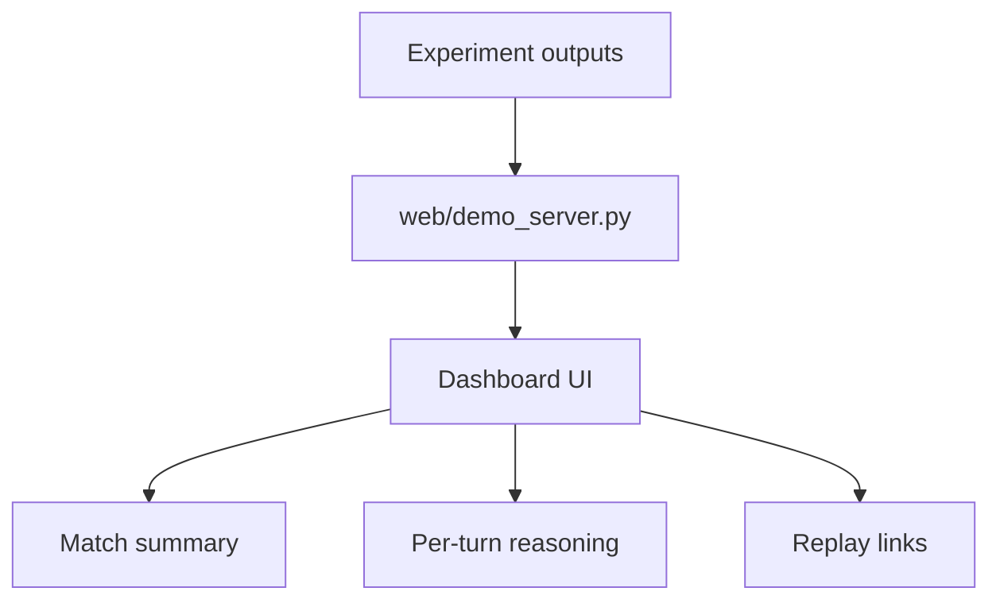

# DuoMon Architecture

This document describes the runtime, training, and analysis boundaries for the
multi-agent battle-coordination system.

## Runtime Decision Flow

The execution-time contract is decentralized at the slot-agent boundary:
agents retain local observations and communicate structured intent rather than
sharing unrestricted internal state.

## Training and Evaluation Loop

This loop separates data collection, feature extraction, model training,
runtime inference, and visual inspection. It keeps experimental artifacts under
explicit output paths instead of coupling them to package code.

## Component Responsibilities

| Component | Responsibility | Boundary |
| --- | --- | --- |
| `duomon/battle` | Adapts Pokemon Showdown state into internal observations | Does not choose actions |
| `duomon/policy_core` | Legal action generation and independent policy primitives | Does not own coordination |
| `duomon/agents` | Intent exchange and joint action selection | Does not train models |
| `duomon/heuristic` | Tactical scoring and threat estimation | Provides features, not final authority |
| `duomon/ctde` | Feature builders, models, training, and evaluation | Produces artifacts consumed by runtime profiles |
| `duomon/benchmarking` | Battle orchestration, metrics, traces, and reports | Does not implement model internals |
| `web` | Local dashboard over saved traces, replays, and metrics | Read-only analysis surface |

## Dashboard Boundary

The dashboard reads generated artifacts and does not control live battles. This
keeps visualization failures from affecting experiment execution.

## Architectural Constraints

- Full runtime validation requires local Pokemon Showdown server and client
  submodules.
- CI currently checks syntax portability; it does not simulate battles.
- Reported results depend on teams, opponents, seeds, and model artifacts.
- Model outputs are experimental signals and should not be treated as robust
  competitive ladder performance.
